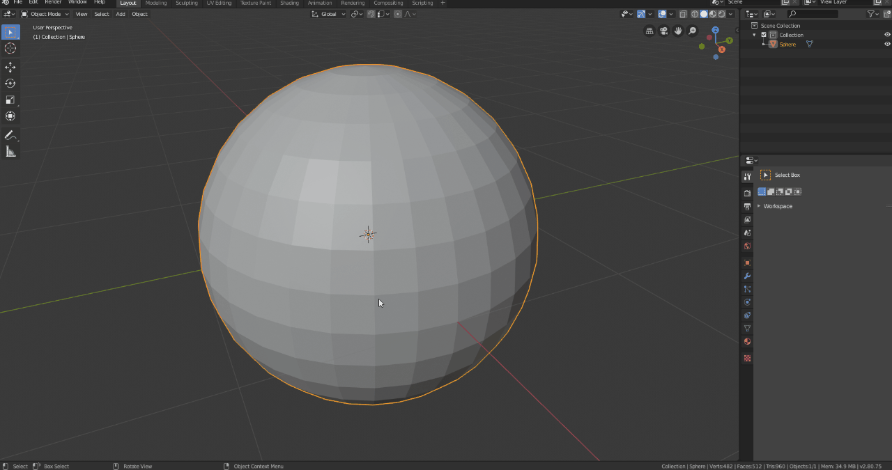

# Dot Loops

Dot Loops is an addon for Blender to easily select groups of parallel and interleaved loops.

## Installation
Go to ``` Edit > Preferences > Addons > Install ```, find the folder you downloaded it to and either select the .zip file.

## Location
The addon will appear only in edit mode in ``` Select > Dot Loops ```.


